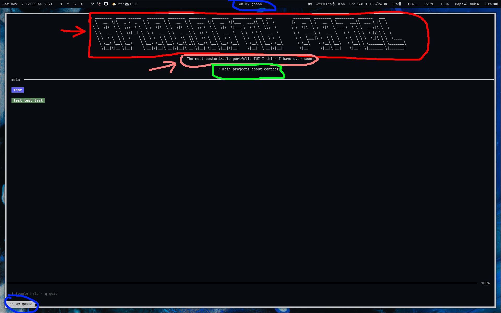

# Config Guide

## Introduction

I will go over the configuration for this project section by section in the toml file.
You can also edit the color scheme by editing the MDStyle.json file which its location is specified by you in the config file.
First thing you need to do is to create the directory for the project. 
On windows:
You are going to make a directory and file at this location:
`%USERPROFILE%\\.config\\ohmygossh\\gossh.toml`

On pretty much any other OS:
You are going to make a directory and file at this location:
`$HOME/.config/ohmygossh/gossh.toml`

## Config File

### Style
This section is for the color scheme of the terminal. You can edit the colors in the MDStyle.json file.

### Title
This section specifies a couple things.
Firstly, the location of the ascii art file. You can change this to any ascii art file you want.
It is the thing that goes at the top of the terminal. It is circled red and pointed red in the image at the bottom of this guide.
Secondly the subtitle. This is the text that goes under the ascii art. It can be anything you want, a quote, a joke, or just a message. It is light red in the image.
Next, the tab name. This is the name the tab will have in the terminal. It is circled blue in the image.
Lastly, the name of the pages in the terminal like main | about | projects | contact. It is circled green in the image.

### SSH
There are three components in the SSH section of the config.
Firstly a boolean integer that specifies if you want to use the ssh feature. If you want to use it, set it to 1, if not, set it to 0.
Secondly, the host. By default it is set to localhost. You can change it to any host you want.
Lastly the port you want to serve the ssh server on. By default it is set to 19.

### Color
It can change the colors of stuff in the thing (it doesn't actaully work just configure colors in the MDStyle.json file)
Refer to the [Glamour styles documentation](https://github.com/charmbracelet/glamour/tree/master/styles) for guidance on available options.

### Projects
You can define as many projects as you would like.
Each project has a file, name, and about.
The file is the location of the markdown file for the project. It looks for files in the config directory so if you specify a markdown file in the projects directory, you would put `projects/example.md` for the file.
The name of the project is the name that will be displayed in the projects page.
The about is a short description of the project that will be displayed in the projects page.

Here is an image to give you a visual representation:

